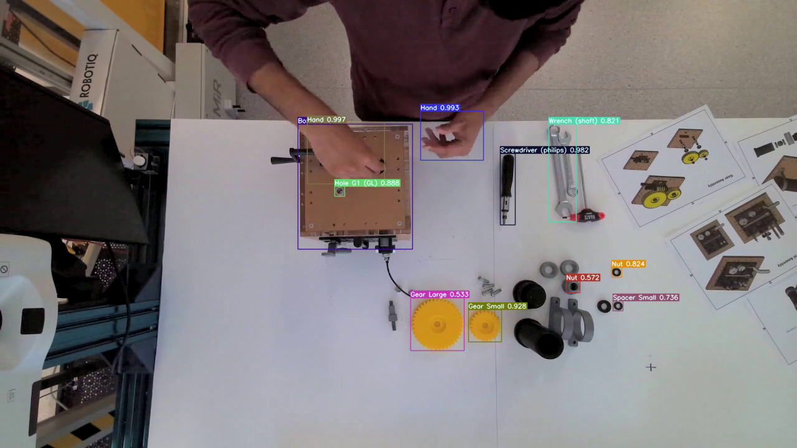
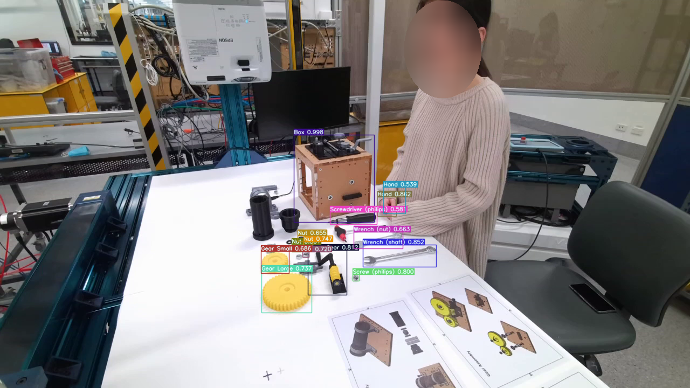
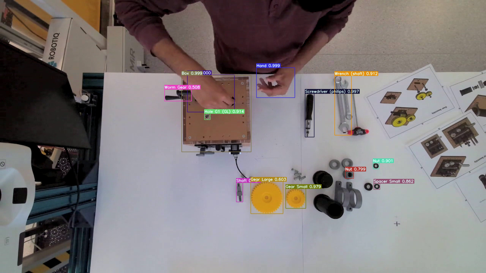

## Project Description

This is a demo of my object detection project. I mainly referred to the [DINO](https://arxiv.org/abs/2203.03605) and [SAM-DETR](https://arxiv.org/abs/2203.06883) paper. The code implementation is also modified based on the official [DINO code](https://github.com/IDEA-Research/DINO).

In brief, I insert a semantic alignment module into DINO to evaluate how much the detection accuracy can be improved. DINO with semantic alignment module is named as SAM-DINO in this project. In addition, I designed a temporal module to experiment with processing multi-frame information using SAM-DINO.

The training and testing data come from [HA-VID](https://iai-hrc.github.io/ha-vid), an assembly dataset for industrial scenarios.

The [checkpoints](https://huggingface.co/tl121212/sam-dino) of SAM-DINO and temporal module have been uploaded to Hugging Face. SAM-DINO's checkpoint is checkpoint_best_regular.pth, while temporal_module.pth is the checkpoint of temporal module.

## Environment

It needs to support normal inference for DINO and SAM-DETR. If you want to inference image, opencv is also needed.

Or you can take the following environment as a reference.

<details>
    <summary>environment</summary>
    
```
_libgcc_mutex                    0.1
_openmp_mutex                    5.1
_pytorch_select                  0.1
addict                           2.4.0
aom                              3.6.0
blas                             1.0
brotlicffi                       1.0.9.2
bzip2                            1.0.8
ca-certificates                  2026.7.16
cairo                            1.18.4
certifi                          2022.12.7
cffi                             1.17.1
charset-normalizer               2.1.1
cloudpickle                      3.1.1
cmake                            3.25.0
contourpy                        1.3.0
cudatoolkit                      11.3.1
cycler                           0.12.1
cython                           3.1.3
dav1d                            1.2.1
expat                            2.7.1
ffmpeg                           4.3
filelock                         3.13.1
flit-core                        3.6.0
fontconfig                       2.14.1
fonttools                        4.59.2
freetype                         2.13.3
fribidi                          1.0.10
fsspec                           2025.9.0
gmp                              6.3.0
gnutls                           3.6.15
graphite2                        1.3.14
harfbuzz                         10.2.0
hf-xet                           1.1.9
huggingface-hub                  0.34.4
icu                              73.1
idna                             3.4
importlib-metadata               8.7.0
importlib-resources              6.5.2
intel-openmp                     2023.1.0
jinja2                           3.1.4
jpeg                             9e
kiwisolver                       1.4.7
lame                             3.100
lcms2                            2.16
ld_impl_linux-64                 2.40
lerc                             4.0.0
libavif                          1.1.1
libdeflate                       1.22
libffi                           3.4.4
libgcc-ng                        11.2.0
libglib                          2.84.2
libgomp                          11.2.0
libiconv                         1.16
libidn2                          2.3.4
libpng                           1.6.39
libstdcxx-ng                     11.2.0
libtasn1                         4.19.0
libtiff                          4.7.0
libunistring                     0.9.10
libuuid                          1.41.5
libuv                            1.48.0
libwebp-base                     1.3.2
libxcb                           1.17.0
libxml2                          2.13.8
lit                              15.0.7
lz4-c                            1.9.4
markupsafe                       2.1.5
matplotlib                       3.9.4
mkl                              2023.1.0
mkl-service                      2.4.0
mkl_fft                          1.3.11
mkl_random                       1.2.8
mpmath                           1.3.0
multiscaledeformableattention    1.0
ncurses                          6.5
nettle                           3.7.3
networkx                         3.2.1
numpy                            2.0.2
opencv-python                    4.9.0.80
openh264                         2.1.1
openjpeg                         2.5.2
openssl                          3.0.18
packaging                        25.0
panopticapi                      0.1
pcre2                            10.42
pillow                           11.0.0
pip                              25.2
pixman                           0.46.4
platformdirs                     4.4.0
pthread-stubs                    0.3
pycocotools                      2.0
pycparser                        2.21
pyparsing                        3.2.3
pysocks                          1.7.1
python                           3.9.23
python-dateutil                  2.9.0.post0
pytorch                          1.11.0
pytorch-mutex                    1.0
pytorch-triton-rocm              2.0.1
pyyaml                           6.0.2
readline                         8.3
requests                         2.28.1
safetensors                      0.6.2
scipy                            1.13.1
setuptools                       78.1.1
six                              1.17.0
sqlite                           3.50.2
submitit                         1.5.3
sympy                            1.13.3
tbb                              2021.8.0
termcolor                        3.1.0
timm                             1.0.19
tk                               8.6.15
tomli                            2.2.1
torch                            2.0.0+rocm5.4.2
torchaudio                       2.0.1+rocm5.4.2
torchvision                      0.15.1+rocm5.4.2
tqdm                             4.67.1
typing-extensions                4.12.2
typing_extensions                4.15.0
tzdata                           2025b
urllib3                          1.26.13
wheel                            0.45.1
xorg-libx11                      1.8.12
xorg-libxau                      1.0.12
xorg-libxdmcp                    1.1.5
xorg-libxext                     1.3.6
xorg-libxrender                  0.9.12
xorg-xorgproto                   2024.1
xz                               5.6.4
yapf                             0.40.1
zipp                             3.23.0
zlib                             1.2.13
zstd                             1.5.6
```
    
</details>

## Command

### Training

(1) Train SAM-DINO.
```
sh DINO_train_swin.sh
```

(2) Train temporal module. 
```
python small_model.py
```

Before training, ensure that lines 553 to 555 in the small_model.py script are consistent with the following code.
```
if __name__=="__main__":
    #evaluate()
    main()
```

Only after the SAM-DINO has been trained can you train the temporal module.  Don't forget to change the SAM-DINO's checkpoint at line 373 in small_model.py.

### Testing

(1) Test SAM-DINO. Change the SAM-DINO's checkpoint in DINO_eval.sh.
```
sh DINO_eval.sh
```

(2) Test temporal module. Change the checkpoints of SAM-DINO and temporal module from line 438 to 439 in small_model.py.
```
python small_model.py
```

Before testing, ensure that lines 553 to 555 in the small_model.py script are consistent with the following code.
```
if __name__=="__main__":
    evaluate()
    #main()
```

### Inferencing image

(1) SAM-DINO. Change the SAM-DINO's checkpoint at line 41 in showing-sam-dino.py.
```
python showing-sam-dino.py -c config/DINO/DINO_4scale_swin.py
```

(2) SAM-DINO with temporal module. Change the checkpoints of SAM-DINO and temporal module from line 154 to 155 in showing-sam-dino-time.py.
```
python showing-sam-dino-time.py -c config/DINO/DINO_4scale_swin.py
```

## Demo of SAM-DINO

The following scenes are from the HA‑VID validation set. Click the image to view the video.

|  | scene 1 | scene 2 |
|---------|---------|---------|
| without temporal module | [](./video_sam_dino_0.mp4) | [](./video_sam_dino_17800.mp4) |
| with temporal module | [](./video_sam_dino_time_0.mp4) | [](./video_sam_dino_time_17800.mp4) |

